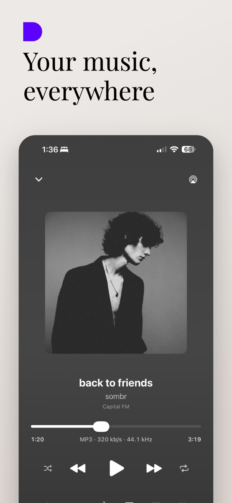
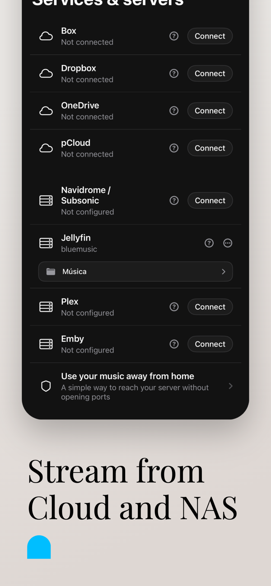
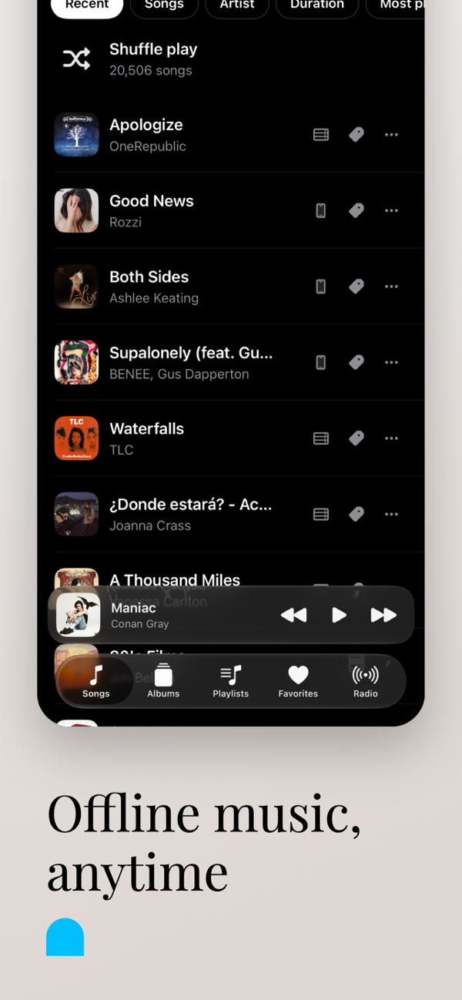
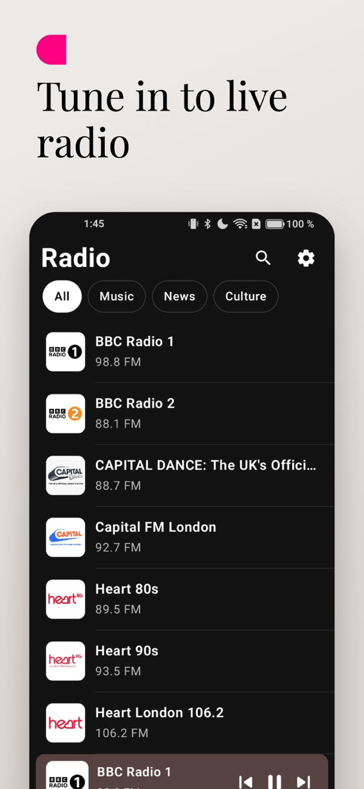

# BlueMusic — local, cloud and server music

> Music player for Android, iOS and smartwatches. Published on
> **[Google Play](https://play.google.com/store/apps/details?id=com.bluemusic.app)** and
> **[App Store](https://apps.apple.com/es/app/id6775983788)**.
>
> This repository is a **product showcase**: the source code is private because the app is
> commercial (subscription). Here I explain what it does and how it is built.

  
  
  
  
  

## What it does

Brings together in a single app the music you have **on your phone**, the music you keep
**in the cloud** (Google Drive, OneDrive, Dropbox, Box, pCloud), and the music on your
**server or NAS** (Jellyfin, Plex, Emby, Navidrome and any Subsonic server).

- Full player: synced lyrics, editable queue, sleep timer, dynamic colors taken from the
  album art, metadata editing.
- Downloads so you can listen offline.
- Online radio: more than 500 stations from 48 countries, and search across thousands.
- **Android Auto** and **CarPlay**.
- Standalone watch apps: **Wear OS** (with song transfer so you can go for a run without
  your phone) and **watchOS**.
- Widgets, Live Activities on iOS, 19 languages, light and dark themes.
- **Premium** (subscription): cloud backup and sync of playlists, favorites and settings,
  working across Android and iOS, and shared playlists in real time.

No ads and no tracking: the app only reads your files in order to play them.

## How it is built

| Layer | Technology |
|---|---|
| Android | Kotlin, **Jetpack Compose**, Media3/ExoPlayer, Room |
| iOS | **native SwiftUI**, AVFoundation, WidgetKit |
| Shared code | **Kotlin Multiplatform**: a `sharedCore` module with the common logic that iOS consumes as a framework |
| Watches | Wear OS (Compose for Wear) and watchOS (SwiftUI) |
| Backend | Firebase: Auth, Firestore, Cloud Functions (subscriptions, sync, shared playlists), App Check |
| Integrations | REST APIs for Jellyfin, Plex, Emby and Subsonic; OAuth with the cloud providers; ShazamKit |

### Technical decisions I am proud of

- **Parity between platforms.** The same app in Compose and in SwiftUI, making sure both
  behave the same way: the logic lives in shared Kotlin and each platform provides its own
  native UI. I compare the two with real screenshots before every release.
- **Real-time sync without overwriting data.** Two devices can edit the same playlist
  offline; when they come back, they reconcile using revision numbers validated in the
  server rules and *tombstones*, so a device that was disconnected does not bring back what
  another one deleted.
- **Tokens that are not stored in plain text.** The OAuth tokens for the servers and the
  clouds are encrypted with a key from the **Android Keystore** and **AES/GCM** before they
  are written. If the keystore is corrupt or comes from a restore, the app degrades to "no
  cloud session" instead of failing at startup.
- **Album art on demand.** It is requested from the API when the row shows up on screen,
  with a thumbnail-first pass, so a library of thousands of songs does not load images
  nobody is going to see.

## Publishing

Two stores, Apple and Google reviews passed, a privacy policy, server-verified
subscriptions, screenshots and store listings in several languages. And the maintenance
that comes afterwards: production bugs, data migrations for users who already have it
installed, and new releases every few weeks.

---

Pedro Antonio Flores Casquet · [github.com/PedroFlores199](https://github.com/PedroFlores199)
