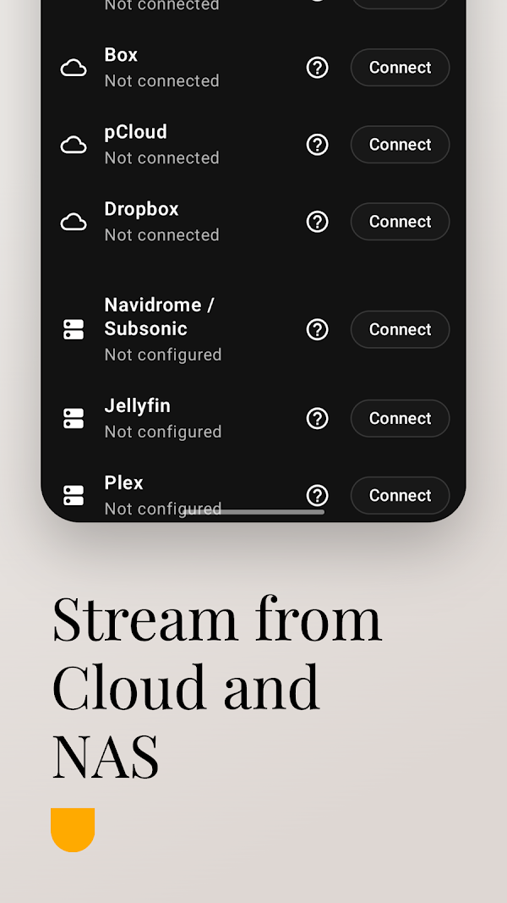
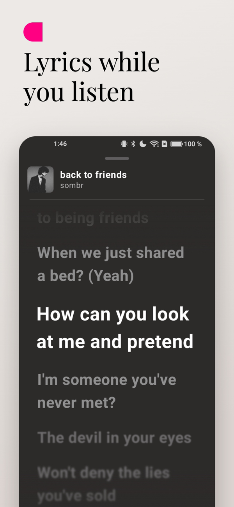
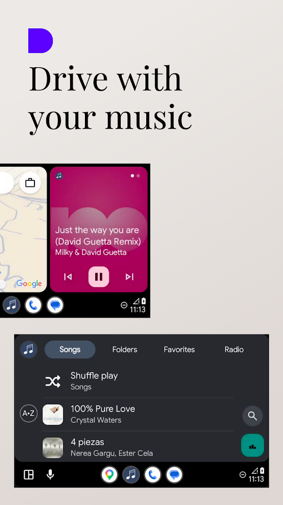
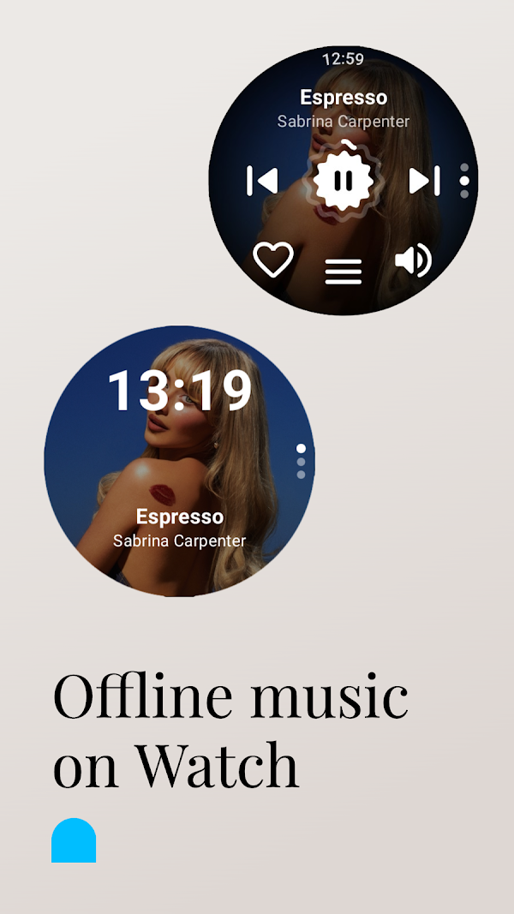

# BlueMusic — música local, de la nube y del NAS

> Reproductor de música para Android, iOS y relojes. Publicado en
> **[Google Play](https://play.google.com/store/apps/details?id=com.bluemusic.app)** y
> **[App Store](https://apps.apple.com/es/app/id6775983788)**.
>
> Este repositorio es una **presentación del producto**: el código fuente es privado
> porque la app es comercial (suscripción). Aquí explico qué hace y cómo está construida.

  
  
  
  
  

## Qué hace

Reúne en una sola app la música que tienes **en el móvil**, la que guardas **en la nube**
(Google Drive, OneDrive, Dropbox, Box, pCloud) y la de tu **servidor o NAS**
(Jellyfin, Plex, Emby, Navidrome y cualquier servidor Subsonic).

- Reproductor completo: letras sincronizadas, cola editable, temporizador de sueño,
  colores dinámicos según la carátula, edición de metadatos.
- Descargas para escuchar sin conexión.
- Radio online: más de 500 emisoras de 48 países, y búsqueda entre miles.
- **Android Auto** y **CarPlay**.
- Apps independientes de reloj: **Wear OS** (con transferencia de canciones para
  correr sin el móvil) y **watchOS**.
- Widgets, Live Activities en iOS, 19 idiomas, tema claro y oscuro.
- **Premium** (suscripción): copia de seguridad y sincronización en la nube de listas,
  favoritos y ajustes, compatible entre Android e iOS, y listas compartidas en tiempo real.

Sin anuncios y sin rastreo: la app solo lee tus archivos para reproducirlos.

## Cómo está construida

| Capa | Tecnología |
|---|---|
| Android | Kotlin, **Jetpack Compose**, Media3/ExoPlayer, Room |
| iOS | **SwiftUI nativo**, AVFoundation, WidgetKit |
| Código compartido | **Kotlin Multiplatform**: un módulo `sharedCore` con la lógica común que iOS consume como framework |
| Relojes | Wear OS (Compose for Wear) y watchOS (SwiftUI) |
| Backend | Firebase: Auth, Firestore, Cloud Functions (suscripciones, sincronización, listas compartidas), App Check |
| Integraciones | APIs REST de Jellyfin, Plex, Emby y Subsonic; OAuth con los proveedores de nube; ShazamKit |

### Decisiones técnicas de las que estoy orgulloso

- **Paridad entre plataformas.** La misma app en Compose y en SwiftUI, cuidando que se
  comporten igual: la lógica vive en Kotlin compartido y cada plataforma pone su UI
  nativa. Comparo ambas con capturas reales antes de cada versión.
- **Sincronización en tiempo real sin pisar datos.** Dos dispositivos pueden editar la
  misma lista sin conexión; al volver, se reconcilian con números de revisión validados
  en las reglas del servidor y *tombstones* para que un dispositivo desconectado no
  resucite lo que otro borró.
- **Tokens que no se guardan en claro.** Los tokens OAuth de los servidores y las nubes
  se cifran con una clave del **Android Keystore** y **AES/GCM** antes de escribirse.
  Si el keystore está corrupto o viene de una restauración, la app degrada a «sin sesión
  de nube» en vez de fallar al arrancar.
- **Carátulas bajo demanda.** Se piden por API cuando la fila aparece en pantalla, con un
  barrido miniatura-primero, para que una biblioteca de miles de canciones no cargue
  imágenes que nadie va a ver.

## Publicación

Dos tiendas, revisiones de Apple y Google superadas, política de privacidad,
suscripciones verificadas en servidor, capturas y fichas en varios idiomas. Y el
mantenimiento que viene después: fallos en producción, migraciones de datos de usuarios
ya instalados y versiones nuevas cada pocas semanas.

---

Pedro Antonio Flores Casquet · [github.com/PedroFlores199](https://github.com/PedroFlores199)
